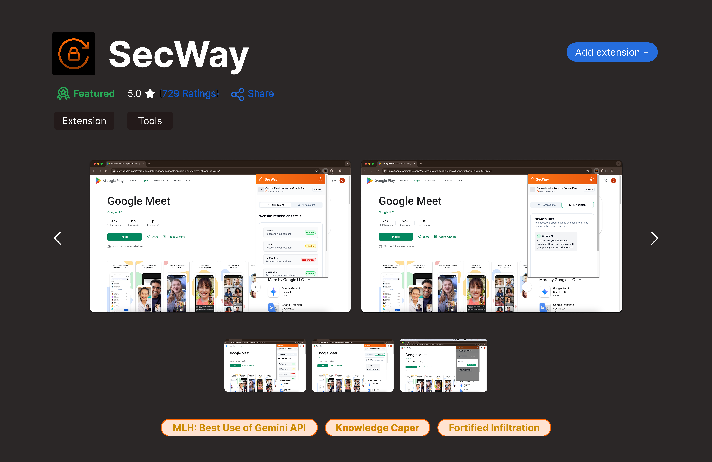

# SecWay
> ### **Your AI Ally For Privacy You Understand**

  Built with:  
  
  
  
  
  

---

### Inspiration

Today’s web is full of hidden threats—phishing scams, data leaks, and overreaching permissions. But most users don’t read the fine print. In fact, **62% never change app or website permissions after first use**. This puts millions at risk, especially those who aren't tech-savvy.

**SecWay** was born out of a desire to make cybersecurity **simple, human, and accessible**. It’s an AI-powered Chrome extension that **demystifies digital privacy**, helping users take control of their personal data without needing a tech degree.

---

### What It Does

SecWay is your lightweight, always-on privacy companion that keeps an eye out for risky behavior while you browse.

**Key Features:**
- **Real-Time Privacy Scanner**  
  Flags suspicious websites, risky permissions, and overreaching data requests as they happen.

- **AI-Powered Privacy Guidance**  
  Powered by **Gemini**, SecWay provides plain-English explanations and smart suggestions to keep you safe.

- **Educational Nudges**  
  “Did You Know?”-style tips explain potential risks based on your browsing habits and comfort level.

- **Risk Indicators**  
  Clear, color-coded ratings (🟢 green = safe, 🟠 review, 🔴 red = danger) help you make better choices instantly.

- **Secure Me Button**  
  With one click, clean up risky permissions and apply AI-recommended safe defaults.

---

### Challenges We Ran Into

- **Balancing Simplicity and Depth**  
  Making the experience intuitive for non-tech users while maintaining meaningful analysis.
  
- **Local-Only Architecture**  
  Running everything in-browser without a backend meant using clever combinations of browser APIs and lightweight ML tools.

---

### Accomplishments We're Proud Of

- **No Backend, No Data Collection**  
  100% local and privacy-first. Nothing leaves your browser.

- **Modular, Extensible Architecture**  
  Easily adaptable to Firefox, Edge, and future platforms.

- **Conversational AI Integration**  
  Gemini makes complex topics approachable through real-time guidance.

- **One-Click Cleanup**  
  Immediate, intelligent action with zero overwhelm.

---

### What We Learned

- **User-Centric Security Design**  
  Empowerment builds more trust than scare tactics.

- **Conversational AI in the Browser**  
  Gemini opens doors to real-time education and assistance.

- **Keeping It Lightweight**  
  Smart design decisions can deliver powerful features without bloating the browser.

---

### What’s Next for SecWay

- **Firefox & Edge Support** – Broaden protection beyond Chrome.
- **School & Library Outreach** – Spread awareness to public institutions and digital newcomers.
- **Scam Detection Leaderboard** – Crowdsourced scam reporting for public good.
- **Mobile Browser Tips** – Privacy nudges for iOS & Android users.
- **Parental Control Mode** – Help families guide and protect young users online.
- **Smarter Threat Intelligence** – Enhance phishing detection with continuous AI model updates.
